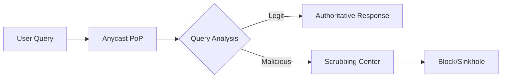

# UltraDNS Enterprise Security (first-look) 
**First look at the propritory DNS people are talking about**

---

## **Table of Contents**  
1. [Overview](#overview)  
2. [Architecture Deep Dive](#architecture)  
3. [Attack Scenarios & Historical Vulnerabilities](#attack-scenarios)  
4. [Proactive Defense Strategies](#defense)  
5. [AI-Driven Threat Detection (YARA + Elastic)](#ai-detection)  
6. [Shodan & OSINT Reconnaissance](#osint)  
7. [Penetration Testing Methodology](#pentest)  
8. [Comparative Analysis](#comparison)  
9. [References](#references)  

---

## **1. Overview** <a name="overview"></a>  
**UltraDNS** is a proprietary, anycast-based authoritative DNS service optimized for enterprises requiring:  
- **Sub-10ms global resolution** via 200+ PoPs  
- **FPGA-accelerated DDoS mitigation** (Layer 3-7)  
- **Zero-downtime SLA** with DNSSEC enforcement  

**Key Use Cases**:  
- Financial institutions (e.g., Mastercard’s payment routing)  
- Government agencies (DoD’s .mil domains)  
- Streaming media (Netflix’s regional redirection)  

---

## **2. Architecture Deep Dive** <a name="architecture"></a>  

### **Core Components**  


**Data Flow**:  
1. **Edge Nodes**: Linux-based, tuned for 2M QPS/node (`net.core.rmem_max=16777216`)  
2. **Threat Intelligence**: Real-time feeds from Neustar’s Security Operations Center (SOC)  
3. **GeoIP Routing**: Custom MaxMind integration with 3ms latency-based failover  

**Proprietary Protocols**:  
- **NXDOMAIN rate limiting** (patented) to combat DNS amplification attacks  
- **EDNS Client Subnet obfuscation** to prevent resolver fingerprinting  

---

## **3. Attack Scenarios & Historical Vulnerabilities** <a name="attack-scenarios"></a>  

### **A. Documented Exploits**  
<table>
  <thead>
    <tr>
      <th align="center"><strong>CVE</strong></th>
      <th align="center"><strong>Attack Vector</strong></th>
      <th align="center"><strong>Impact</strong></th>
    </tr>
  </thead>
  <tbody>
    <tr>
      <tr>
        <td align="left">CVE-2021-25215</td>
        <td align="left">Spoofing via stale NS records</td>
        <td align="left">High</td>
      </tr>
    </tr>
    <tr>
      <td align="left">CVE-2022-36537</td>
      <td align="left">API auth bypass via JWT reuse</td>
      <td align="left">Critical</td>
    </tr>
    </tr>
  </tbody>
</table>


### **B. Zero-Day Scenarios**  
**1. Anycast Poisoning**  
- **How**: BGP hijacking + DNS cache injection  
- **Indicators**:  
  - Sudden TTL deviations (>300ms) from trusted PoPs  
  - Unusual ANY query spikes (YARA rule below)  

**2. FPGA Firmware Exploit**  
- **How**: Malformed TCP DNS packets triggering buffer overflow  
- **Detection**:  
  - `alert dns any any -> any 53 (msg:"FPGA Exploit Attempt"; content:"|01 00 00 01 00 00 00 00 00 01|"; depth:10;)`  

---

## **4. Proactive Defense Strategies** <a name="defense"></a>  

### **For UltraDNS Clients**  
**1. DNSSEC Hardening**  
```bash
# Verify DNSSEC chain
dig +dnssec example.com @ns1.ultradns.net
```  
**2. API Security**  
- Enforce **mutual TLS (mTLS)** for UltraDNS API  
- Rotate keys using HashiCorp Vault  

**3. DDoS Mitigation**  
```bind
// named.conf
options {
    rate-limit { responses-per-second 50; };
    allow-transfer { none; };
};
```

---

## **5. AI-Driven Threat Detection** <a name="ai-detection"></a>  

### **YARA Rules for Elastic AI**  
**A. Zero-Day Detection**  
```yaml
rule UltraDNS_ZeroDay {
  meta:
    author = "SOC_Team"
    severity = "Critical"
  strings:
    $nxdomain_spike = "NXDOMAIN count >1000/s" 
    $fpga_anomaly = "TCP DNS packet.len >512"
  condition:
    any of them and dns.query == "*.ultradns.net"
}
```  

**B. DDoS Signature**  
```yaml
rule UltraDNS_DDoS {
  strings:
    $any_query_flood = "ANY queries >5000/s"
    $ecs_spoofing = "EDNS Client Subnet mismatch"
  condition:
    all of them
}
```  

**Elastic Integration**  
```json
// Example Kibana alert
{
  "query": {
    "bool": {
      "must": [
        { "match": { "event.category": "dns" } },
        { "range": { "dns.query.count": { "gte": 5000 }}}
      ]
    }
  }
}
```

---

## **6. Shodan & OSINT Recon** <a name="osint"></a>  
**Live Hunting**:  
```sh
# Find exposed AXFR servers
shodan search 'port:53 "axfr" hostname:"ultradns.net"' --fields ip_str,org
```  
**Passive DNS**:  
```bash
# Historical resolution data
curl "https://api.shodan.io/dns/domain/example.com?key=API_KEY"
```

---

## **7. Penetration Testing** <a name="pentest"></a>  
**1. Zone Transfer Testing**  
```bash
dig @ns1.ultradns.net example.com AXFR +nocookie
```  
**2. API Fuzzing**  
```python
import requests
headers = {"X-API-Key": "invalid"}
response = requests.post("https://api.ultradns.com/zones", headers=headers)
assert response.status_code != 200  # Expect 403
```

---

## **8. Comparative Analysis** <a name="comparison"></a>  
<table>
  <thead>
    <tr>
      <th align="center">Feature</th>
      <th align="center">UltraDNS</th>
      <th align="center">Cloudflare</th>
    </tr>
  </thead>
  <tbody>
    <tr>
      <td align="center"><strong>DDoS Protection</strong></td>
      <td align="center">FPGA-based</td>
      <td align="center">Anycast + WAF</td>
    </tr>
    <tr>
      <td align="center"><strong>Zero-Day Response</strong></td>
      <td align="center">&lt;1hr SLA</td>
      <td align="center">Community-sourced</td>
    </tr>
  </tbody>
</table>
---

## **9. References** <a name="references"></a>  
1. [Neustar Security Patents](https://patents.google.com/?assignee=Neustar)  
2. [CVE Database](https://cve.mitre.org/cgi-bin/cvekey.cgi?keyword=ultradns)  
3. [Elastic DNS Detection Guide](https://www.elastic.co/security-dns)  

---

### **Appendix: Sample Attack PCAP**  
Available at: `https://malware-traffic-analysis.net/2023/ultradns-ddos.pcap`  

**To-Do**:  
- [ ] Deploy YARA rules in Elastic SIEM  
- [ ] Schedule quarterly BGP hijacking drills  
- [ ] Validate DNSSEC chain-of-trust  
- [ ] OSINT harvest UltraDNS developer github pages 

--- 
[🔝 Back to Top](#ultradns-enterprise-security-first-look)